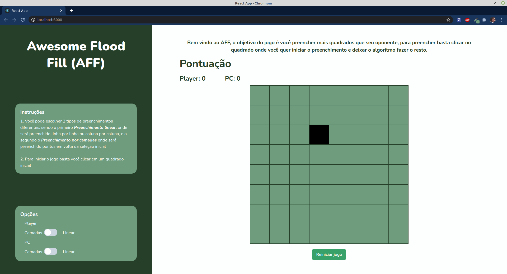
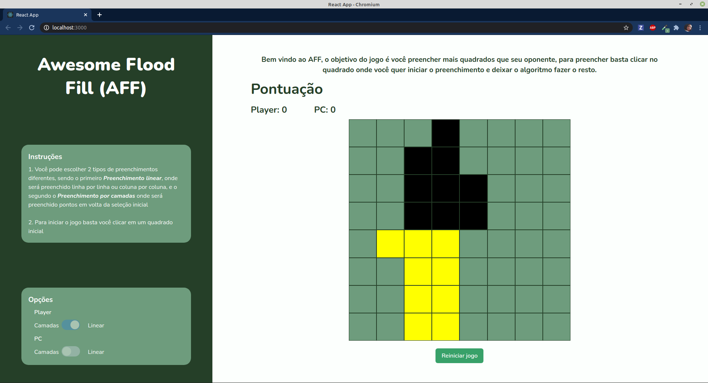
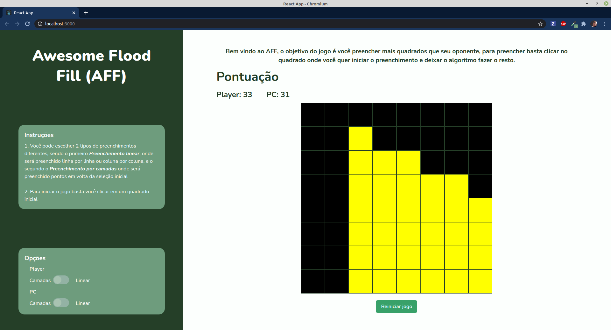

# Grafos1_AFF

# Awesome Flood Fill (AFF)

**Número da Lista**: 3<br>
**Conteúdo da Disciplina**: Grafos 1<br>

## Alunos
|Matrícula | Aluno |
| -- | -- |
| 17/0139981 |  Danillo Gonçalves de Souza |
| 17/0013910 |  Joao Pedro Jose Santos da Silva Guedes |

## Sobre 
O objetivo do projeto é a aplicação dos conteúdos da disciplina Projeto de Algoritmos em um contexto real. O contexto selecionado pela dupla foi a criação de um jogo onde o jogador deve preencher mais campos que o outro. Por trás deste jogo estão sendo aplicados conceitos como  **Grafos**, **BFS**, **DFS** e **Flood Fill**.

## Screenshots




## Instalação 
**Linguagem**: Javascript<br>
**Framework**: ReactJS<br>
Para rodar o projeto você precisará instalar na sua máquina:
- [Node.js](https://nodejs.org/en/)
- [Yarn](https://yarnpkg.com/)*

\* A instalação do yarn não é obrigatória, porém por ser mais estável é preferível a sua utilização.

Para rodar o projeto basta entrar na pasta graphs e executar os seguintes comandos

**Utilizando yarn**
```
yarn install
yarn start
```

**Utilizando npm**
```
npm install
npm start
```

## Uso 
Após executar automaticamente ele abrirá uma aba no seu navegador com o projeto rodando, caso isto não aconteça basta acessar seu localhost com a porta indicada no terminal ao executar os comandos.
